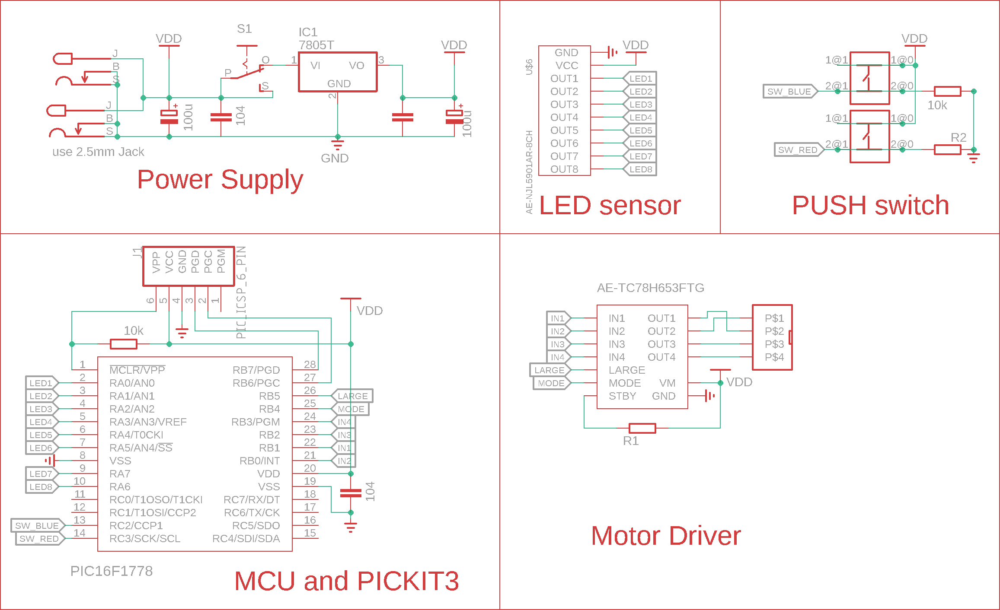
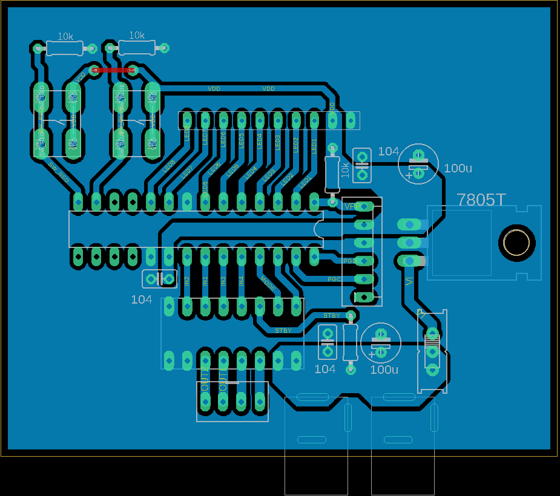

# 機体のコンセプト

## パワートレイン

4 輪駆動か履帯駆動を考えたが,コスト面から履帯駆動に決めた.履帯駆動は通常の車輪よりも接地面積が大きいため,地面が滑りやすくてもトルクが伝達できること,左右どちらかの履帯を固定し、もう片方を駆動することで小回りがきく(信地旋回)などの利点がある。  
ギアボックスとモーターは市販のキットを購入し、RA-130 モータを 58:1 のギア比で使用し、最高速度を重視した.

## 車体設計

プラスチックの板を基礎にし,ギアボックスや履帯用のプーリー,ライントレース用センサーをネジ止めし、電池ボックスは取り外しやすいようにマジックテープで取り付けた.

## センサー部分

市販のセンサーの配線を改造して使用した.

## モータードライバー

tc78h653ftg という 2 モーター出力できるモータドライバーを使用した.

# 自分の担当した箇所

## ハードウェア

- 機体設計
  - コンセプトの考案
  - 使用機材の選定(ユニバーサルプレート、ツインモータギヤボックス)
- 基板設計

  - Autodesk EAGLE を使用して基板を設計した.  
     半田付けがしやすいように銅の幅をを大きくする、 できるだけ一面で基板を作る などの工夫をした.
  - 電源設計  
    FA-130 の定格電圧は 3V、モータドライバーの最大定格が 8V だったので、1.2V のニッケル水素畜電池を 6 個直列に接続したものをモータドライバーに印加し、そこから三端子レギュレータで降圧した 5V をマイコンなどに供給した.

- 基板製造  
  高木君が組み立てた機体に基板を取り付けた.
- 配線  
  基板を取り付けた後に配線の長さを測り、配線を取り付けた.機体の一部に穴を開けて配線を通すようにすることで、ほかのものに配線がひっかからないようにした.

## ソフトウェア

- API 作成  
   もともとは複数人で開発する予定であったので、モーターや LED などが抽象化された API を作成した.
- PID 制御  
   API 作成に時間がかかり、PID 制御は走行会までに実装できなかったが、本来は左右のライントレースに PID 制御を用いる予定だった.

# 回路図と使用部品

今回作成した基板の設計図を図[@fig:a_image]に表す.
{#fig:a_image}
マイコンの電圧は 5V で、発振器は内部のものを使用した.

DC ジャックが 2 個あるのは、電池一組で出力が足りなかった時のために用意した.

プッシュスイッチは、スタートスイッチや、プログラムの切り替えなどに用いる予定だったが、走行会までに実装できなかった.
|
No.| 機器名| 型番など シリアルナンバー|
---|---------|
1 |マイコン | PIC16F1778 |
2 |モータードライバー | AE-C78H653FTG |
3 |ツインモータギヤボ|ス タミヤ Item No:70097 |
4 |トラック&ホイールト |タミヤ Item No:70100 |
5 |ユニバーサルプレート|ミヤ Item No:70157 |
6 |ライントレース用センー| E-NJL5901AR-8CH |

# 基板図

今回作成した基板の設計図を図[@fig:b_image]に表す.
{#fig:b_image}
マイコンの電圧は 5V で、発振器は内部のものを使用した.緑色や青色の部分は裏面の配線で、エッチング時に銅が残る範囲を表している。
白色の部分はマイコンなどの配置を表している。赤い線の部分は裏面のみで配線できず、表面に抵抗の足を使って接続した部分である。

# フローチャート

フローチャートを図に表す。!(fig3.drawio.svg){#fig:fig3}

# 走行会の結果

9 月 27 日の走行会では、コースを完走することは出来なかった。

PID 制御のプログラムが完成しなかったため、急遽 ONOFF 制御のプログラムに差し替えたが、ラインの検知が出来ず直進しかしなかった。

# 総括

今回完走できなかった原因はプログラムに問題があったと思われる。

モータードライバーへ PWM 信号を出力するときに、CCP 機能ではなくタイマー割込みを用いて行った。

割込み周期が 4us と短すぎたため、割込み処理の途中で割込みが発生していた。

改善点としては、PWM 信号は、CCP 機能に任せてメインの処理に時間をさくこと、割込み周期を下げ、割り込み処理中に割込みが入らないようにすること、割込み処理の最初で割込みを禁止しておくことなどがあげられる。

付録: 今回作成したソースコードと解説
