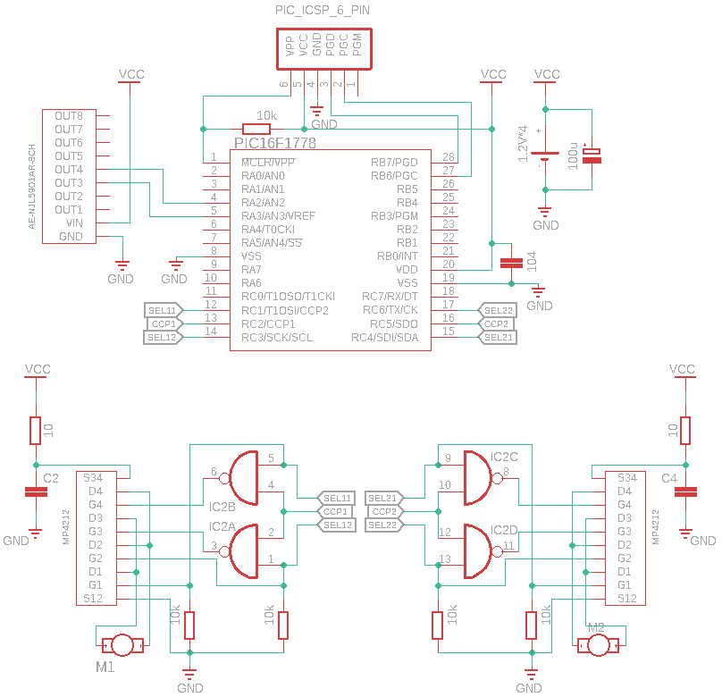
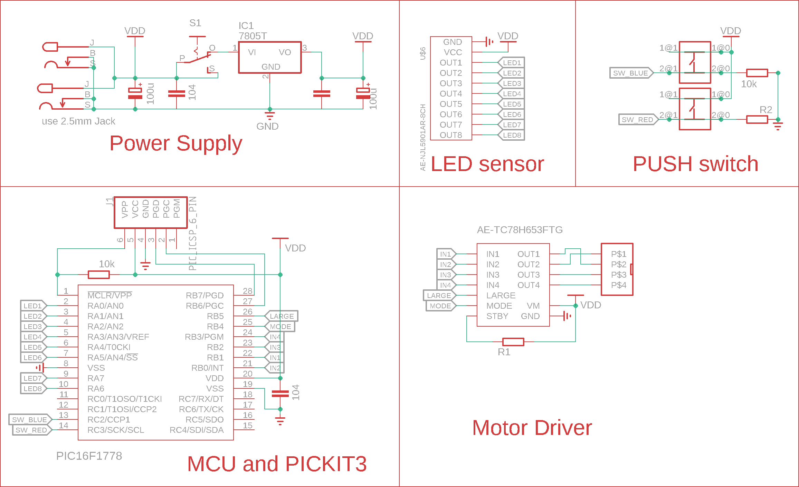

---
pdf_options:
  format: a4
  margin: 30mm 20mm
  printBackground: true
footerTemplate: |-
    <section>
      <div>
        Page <span class="pageNumber"></span>
        of <span class="totalPages"></span>
      </div>
    </section>
	stylesheet:
  ./style.css
body_class: markdown-body
highlight_style: monokai
 ---
# 実験内容

PIC16F1778を用いてライントレーサーを製作する。

今回の実験で用いた回路を以下に表す。

今回はPIC16F1778からFETアレイ(MP4212)に出力するときのバッファーとして74HC00を用いた。


今回の実験でオーバルコースを走行するために作成したフローチャートを以下に表す。


今回の実験で用いたプログラムを以下に表す。
```c
#
```
（

※回路図や，フローチャート，プログラムについては，文章による説明を記載すること。  ）

・自分自身の担当部位と工夫したことなどを記載。

・ブレッドボード上で組んだ回路で動いたか，動かなかったか

（2）ブレッドボード上で組んだ回路で走らなかった場合
・走らなかった原因を各自で考察。また，改善すべき点なども
記載すること。
